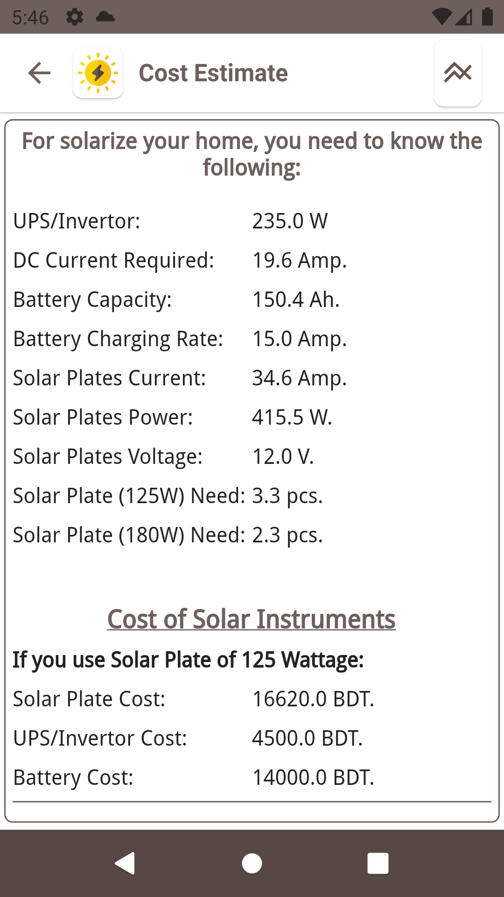
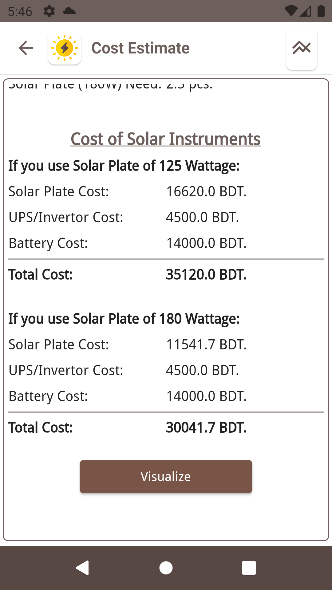
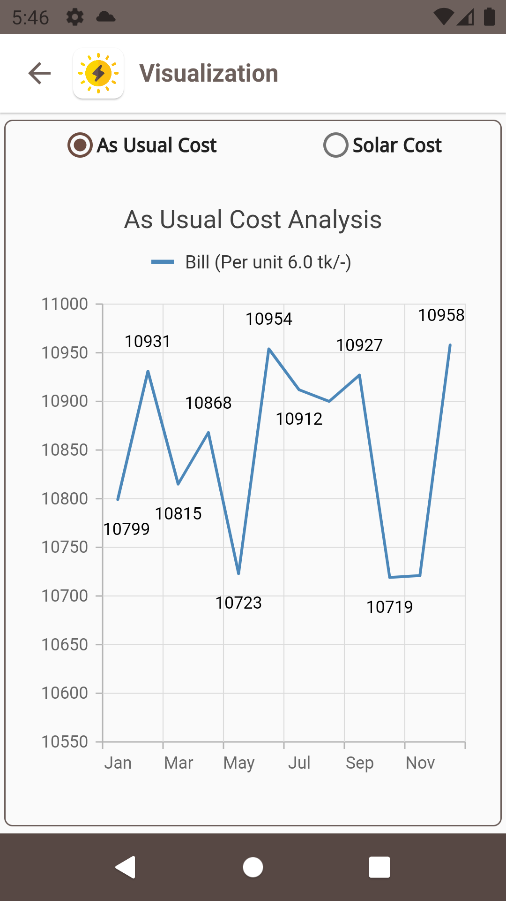
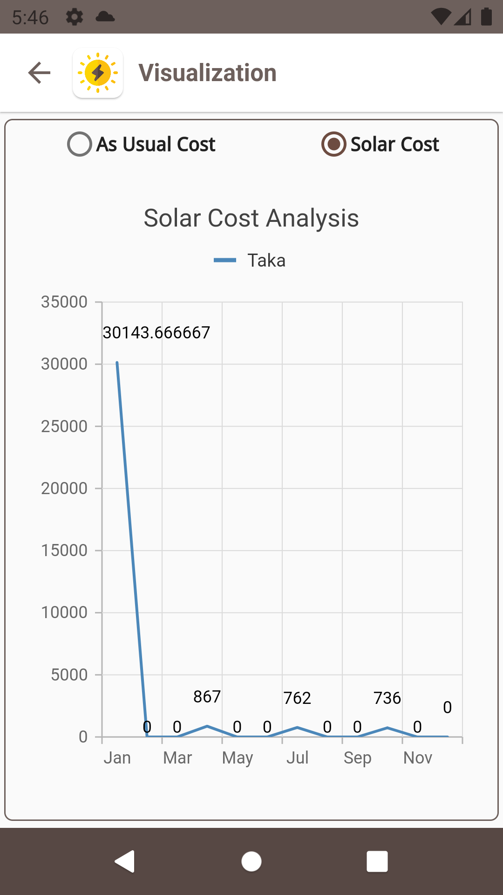

# solar_cost_calculator

A flutter project which calculates cost of solar implementaion at home based on requirement or consumption of your house.

<table>
  <tr>
    <td></td>
    <td></td>
    <td></td>
  </tr>
 </table>

<table>
  <tr>
    <td></td>
    <td></td>
  </tr>
 </table>

